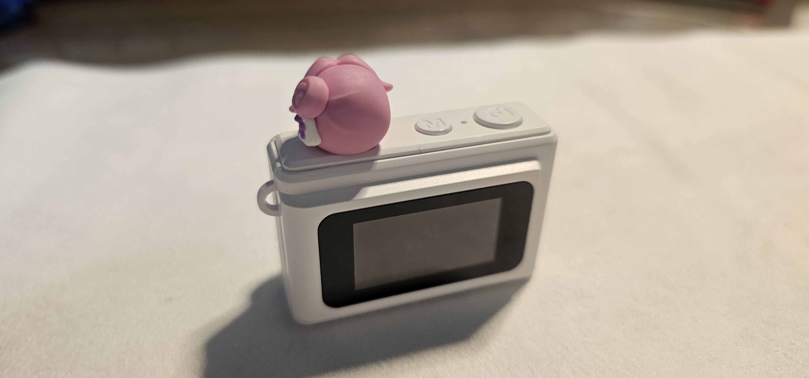
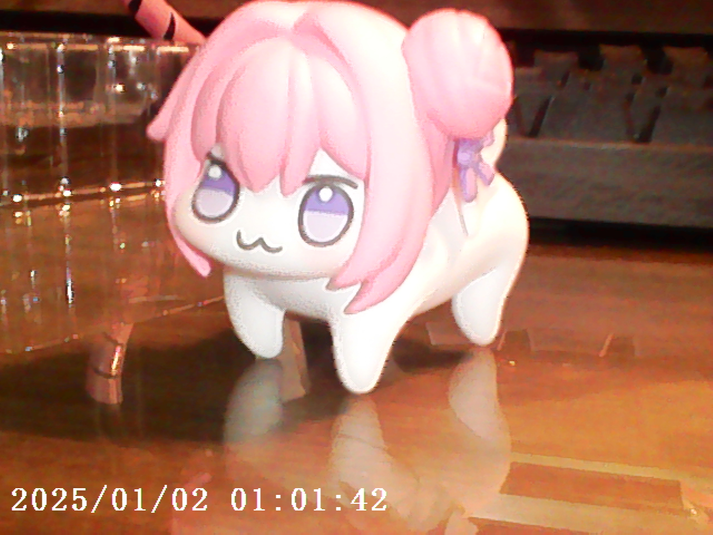
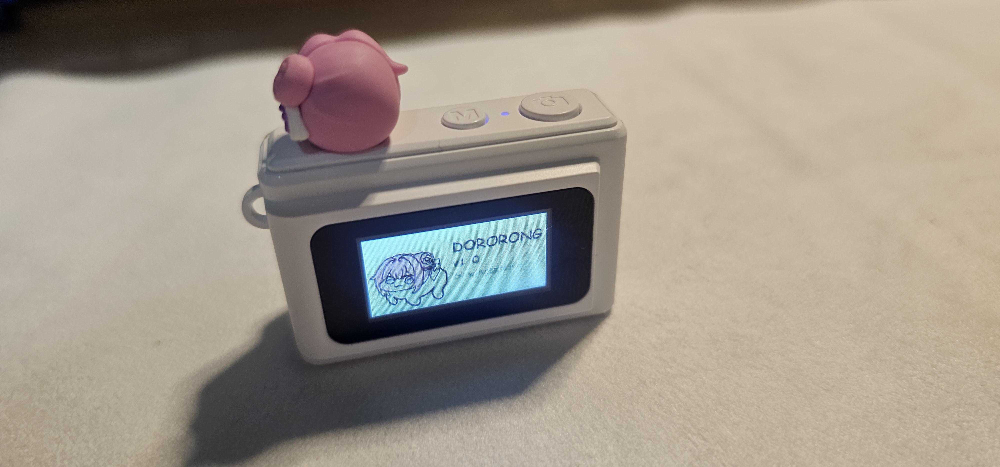
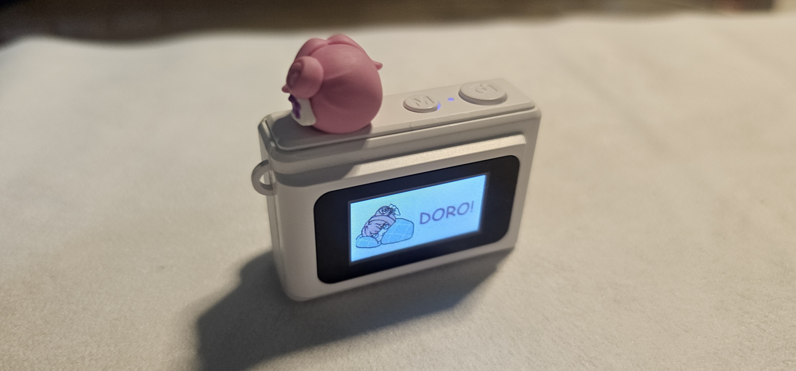
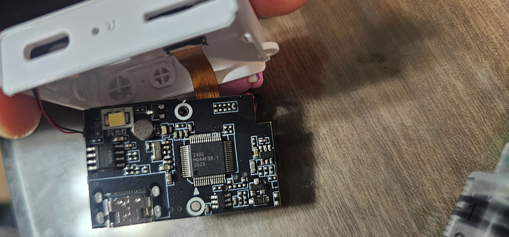
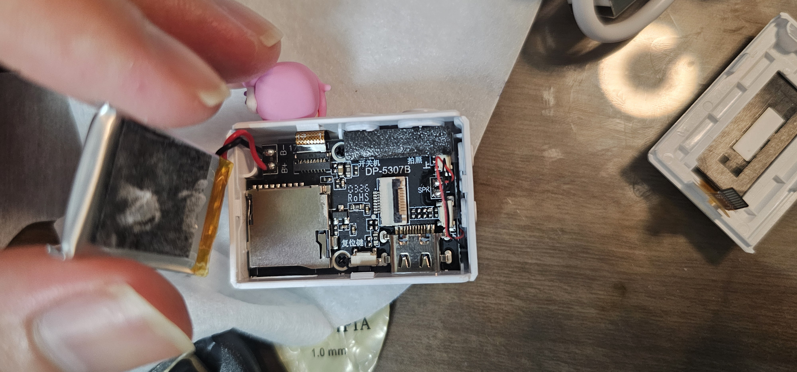

# DORORONG Camera Firmware Mod

Custom firmware project for the DORORONG Camera (DC23 mini camera) based on the **Generalplus GP1235** SoC.

Reverse-engineered from scratch — no SDK, no datasheet, no source code.



## What's Done

### Image Quality (Phase 0-4)

- **JPEG Q-table upgrade**: Replaced quantization tables (Q76 -> Q97), +42% sharpness, -24% block artifacts
- **Resolution fix**: CMP instruction swapping to output 1280x960 instead of upscaled 1600x1200 (-36% upscale ratio)
- **ISP parameter tuning**: Found and tweaked ISP pipeline parameters for better sharpness and reduced chroma noise

| Metric | Before | After |
|--------|--------|-------|
| JPEG Quality | ~76 | ~97 |
| Sharpness (Laplacian) | 71 | 138 |
| Block Artifacts | 1.69 | 1.29 |
| Chroma Noise | 15.7/16.5 | 14.2/15.1 |



### Custom Branding (v1.0)

- **Boot screen**: Custom 160x80 JPEG on the tiny LCD
- **Shutdown screen**: Custom goodbye image
- **Boot/shutdown sounds**: Custom WAV audio
- **Shutter sound**: Custom camera click

| Boot Screen | Shutdown Screen |
|:-----------:|:---------------:|
|  |  |

## Hardware

| Spec | Detail |
|------|--------|
| SoC | Generalplus GP1235 (ARM7TDMI ~144MHz) |
| Sensor | 1MP (1280x720 native) |
| ISP | Hardware pipeline (Gamma, CCM, Sharpen, Denoise, AE/AWB) |
| Flash | 1MB SPI (PY25D80HB) |
| LCD | 160x80 pixels |
| Codec | MJPEG / AVI |

### Teardown

| Front | Back |
|:-----:|:----:|
|  |  |

## Key Discoveries

### Three Checksum Systems (All Solved)

| Checksum | Algorithm | Scope |
|----------|-----------|-------|
| Settings Block | CRC32 (0xEDB88320) | Per-profile bytes 0x00~0xA3 |
| GPNV Bootloader | Unknown (keep original) | Firmware sectors |
| SD Upgrade | Byte sum | Entire file, encoded in filename |

### SD Card Upgrade Protocol

```
Filename: JH_5307_[build_string_13ch][checksum_8ch_hex].bin
Checksum: sum(all_bytes) & 0xFFFFFFFF
```

No programmer needed for firmware updates - just rename and copy to SD card.

### Firmware Memory Map

```
0x000000-0x012000  Bootloader (GPNV header + ARM boot code)
0x012000-0x07C000  Main firmware (ARM32 code)
0x07C000-0x084000  JPEG test patterns, USB descriptors
0x084000-0x0A8000  GPRSPAK resources, WAV sounds, fonts
0x0A8000-0x0B4000  GPZP compressed UI (welcome/goodbye screens)
0x0B4000-0x0C2000  Free space (56KB)
0x0C2000-0x0C5000  Settings block (14 profiles x 512B)
0x0C5000-0x100000  Free space (236KB)
```

## Tools

| Tool | Purpose |
|------|---------|
| `scripts/settings_patch.py` | Settings block patcher with CRC32 + GPNV checksum handling |
| `scripts/analyze_resolution.py` | Resolution truth verification (detect upscaling) |
| `sd_upgrade_tool.py` | Generate correct SD upgrade filename |

### Usage Example

```bash
# Apply ISP settings + branding
python scripts/settings_patch.py firmware.bin --preset phase3 --brand v1.0

# Apply raw code patches (CMP swapping for resolution fix)
python scripts/settings_patch.py firmware.bin \
  --raw-patch 0x1FDD0=0xE35000FF \
  --raw-patch 0x1FDE0=0xE3500002
```

## Project Structure

```
docs/
  first_plan/     Phase 0-6 plan and results
  ongoing/        Firmware analysis notes
  special/        Screen & sound customization guides
scripts/          Patching and analysis tools
analysis/         Firmware binaries and extracted resources
image/            Photos of the camera and results
```

## Lessons Learned

1. **1080P is a lie** - The sensor is 720p native. All higher resolutions are ISP upscaling.
2. **JPEG quality matters most** - Q-table replacement gave the biggest single improvement.
3. **Don't touch GPNV XOR** - The bootloader checksum algorithm is unknown. Keep the original value.
4. **SD upgrade is your friend** - No need to desolder the flash chip for most modifications.
5. **Code patches work** - ARM instruction modification via SD upgrade is safe (confirmed).

## License

This project is for educational and research purposes. Use at your own risk.
